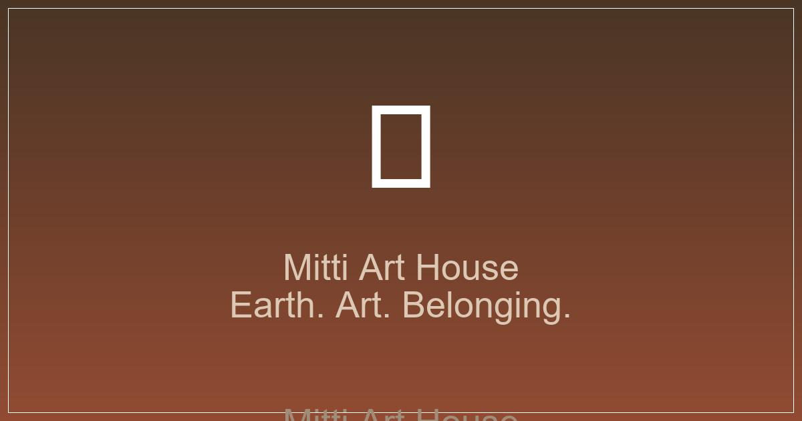
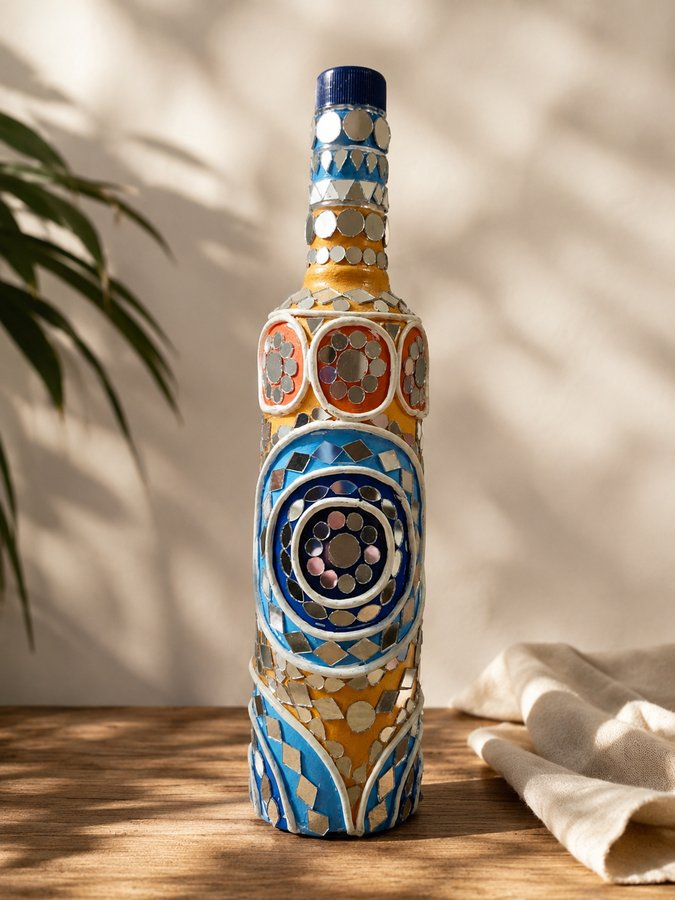
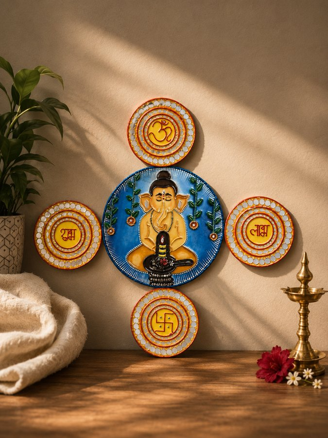
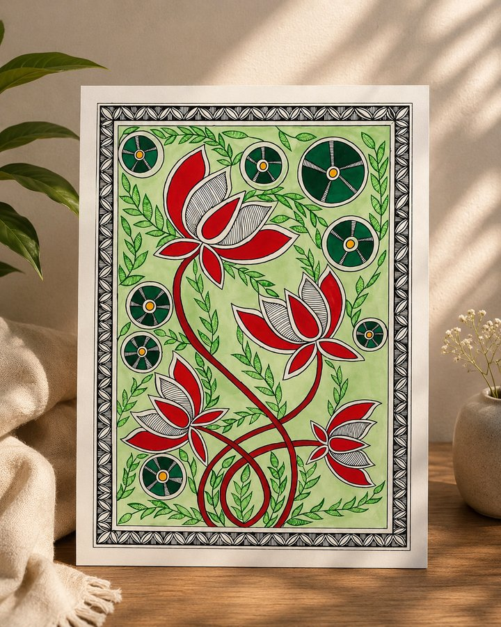
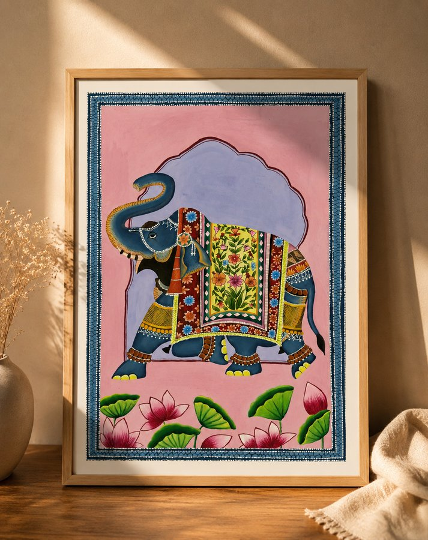

<p align="center">
  <br>
  
</p>

<br>

<p align="center">
  <a href="https://pankajjjat.github.io/Art/">🌍 Live Site</a> •
  <a href="#-features">Features</a> •
  <a href="#-products">Gallery</a> •
  <a href="#-tech-stack">Tech Stack</a> •
  <a href="#-editing-content">Editing</a>
</p>

<br>

<p align="center">
  
</p>

<br>

## 🌱 About

**MITTI (मिट्टी)** is a handcrafted Indian art brand founded by **Saumya**. Rooted in India's rich artistic traditions — from **Lippan (mirror-work) art of Kutch** to contemporary abstract landscapes — each piece is made from earth, for the wall.

> *"From earth, for the wall."*

The name **MITTI** means *soil* — a reminder that every painting begins with clay, pigment, and the hands that shaped them.

---

## ✨ Features

| | |
|---|---|
| 🖼️ **38 Static Pages** — fully generated, zero runtime dependencies | 📱 **Responsive Design** — works on mobile, tablet, desktop |
| 🎨 **Custom Art Cursor** — grain texture with earth-palette trail | 🔮 **Image Fallback Chain** — JPG → SVG → gradient placeholder |
| 🛒 **13 Products** with pricing, dimensions, stock status | 📰 **5 Blog Posts** on Lippan art, decor, and gifting |
| 📍 **Schema.org JSON-LD** on every page (ArtGallery + ItemList) | 🐦 **Open Graph / Twitter Cards** for social sharing |
| ⚡ **GitHub Actions Auto-Build** — edit JSON, push, deploy | 🎯 **Bespoke Earth Palette** — no template generics |

---

## 🎨 Color Palette

```
🟤 #1A1612  Deep Earth / Charcoal
🟤 #3A3028  Dark Clay
🟤 #5A4A3A  Raw Earth
🔴 #8A4A30  Terracotta
🟠 #C2623E  Warm Clay
🟡 #C4883A  Golden Amber
⚪ #F2EBE0  Cream / Parchment
```

---

## 🖼️ Products

<p align="center">
  
  
  
  
  
</p>

| Category | Products | Price Range |
|---|---|---|
| 🏔️ **Landscapes** | Mountain Vista, Midnight Solitude, Forest Canopy, Golden Pastoral | ₹8,999 – ₹12,999 |
| 🌀 **Abstract** | Ethereal Mist, Earthen Flow, Textured Rhythms | ₹9,999 – ₹14,999 |
| ✨ **Lippan Art** | Mirror Mandala, Geometric Radiance, Ornate Opulence | ₹7,999 – ₹15,999 |
| 🌆 **Contemporary** | Urban Layers, Modern Symmetry | ₹9,999 – ₹11,999 |
| 🌟 **Featured** | Golden Cascade | ₹13,999 |

---

## 🛠️ Tech Stack

```
┌─────────────┐    ┌──────────────┐    ┌──────────────┐
│  settings   │    │  products    │    │    blog      │
│  .json      │───▶│  .json      │───▶│   .json      │
└─────────────┘    └──────────────┘    └──────────────┘
       │                  │                   │
       ▼                  ▼                   ▼
┌─────────────────────────────────────────────────┐
│         generate-pages-fixed.py                  │
│  (Python generator — single source of truth)     │
└─────────────────────┬───────────────────────────┘
                      ▼
        ┌─────────────────────────┐
        │  index.html             │
        │  product/<slug>/        │
        │  blog/                  │
        │  faq/ | shipping/       │
        │  payment/               │
        │  css/ | js/             │
        └──────────┬──────────────┘
                   ▼
        ┌─────────────────────────┐
        │  GitHub Actions         │
        │  → auto-commit + push   │
        └──────────┬──────────────┘
                   ▼
        ┌─────────────────────────┐
        │  GitHub Pages           │
        │  https://pankajjjat     │
        │  .github.io/Art/        │
        └─────────────────────────┘
```

**Stack:** Python 3 · Vanilla HTML/CSS/JS · JSON data layer · JPG/SVG images · GitHub Pages + Actions

---

## ✏️ Editing Content

No CMS. No database. **Just JSON files and a push.**

```
data/
├── settings.json    ← Social links, site name, tagline, contact info
├── products.json    ← All 13 products: name, price, dimensions, stock
└── blog.json        ← Blog posts with markdown body content
```

**To update:**

1. Open [github.com/pankajjjat/Art](https://github.com/pankajjjat/Art)
2. Press **`.` (dot key)** — launches VS Code in your browser instantly
3. Edit the JSON file you want to change (e.g. update Instagram URL in `settings.json`)
4. Commit to `main`
5. ✅ **GitHub Actions** auto-generates all HTML pages and deploys in ~30 seconds

> No CLI, no local setup, no login flow. Browser-only.

### Quick Edits

| Change | File | Field |
|---|---|---|
| Instagram / Facebook link | `data/settings.json` | `social.instagram`, `social.facebook` |
| Product price or stock | `data/products.json` | `price`, `inStock` |
| Add a blog post | `data/blog.json` | New object in array |
| Site tagline | `data/settings.json` | `tagline` |

---

## 🌐 Connect

<p align="center">
  <a href="https://www.instagram.com/saumya.chaurasia04">📷 Instagram</a> •
  <a href="https://www.facebook.com/profile.php?id=100077641696027">📘 Facebook</a> •
  <a href="https://pinterest.com/mittiart">📌 Pinterest</a> •
  <a href="https://pankajjjat.github.io/Art/">🌍 MITTI Art Gallery</a>
</p>

---

<p align="center">
  <sub>Built with 🪴 by <a href="https://github.com/pankajjjat">Pankaj</a> for <strong>MITTI (मिट्टी)</strong> — founded by Saumya · © 2024–2025</sub>
</p>
